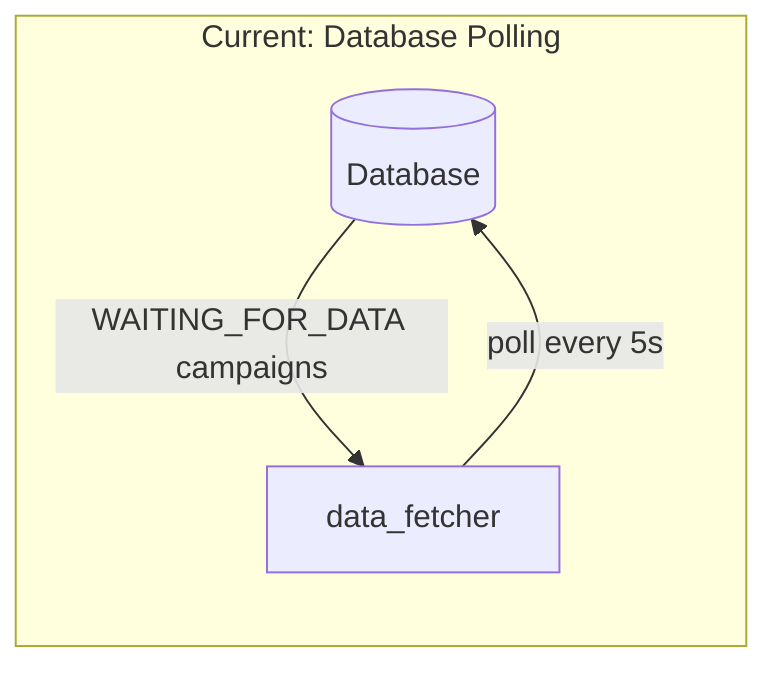
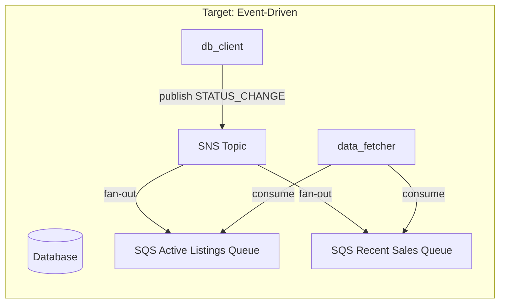

# Event-Driven Active Listings and Recent Sales

## Current State

The system currently uses database polling for active listings and recent sales:




- `poll_for_active_listings_that_need_updated()` in [data_fetcher.py](python/data_fetcher/data_fetcher.py) polls DB every 5 seconds
- `poll_for_recent_sales_that_need_updated()` polls similarly
- Both use `with_for_update(skip_locked=True)` locking which causes contention

## Target State

Event-driven processing using SNS/SQS:




## Implementation Plan

### 1. AWS Infrastructure Setup (Manual)

Create 2 new SQS queues in AWS and subscribe them to the existing `SNS_CAMPAIGN_EVENTS_TOPIC_ARN`:

- `dripr-active-listings-queue-dev` / `dripr-active-listings-queue-prod`
- `dripr-recent-sales-queue-dev` / `dripr-recent-sales-queue-prod`

### 2. Environment Variables

Add to [local-dev.env](local-dev.env) and [prod.env](prod.env):

```javascript
SQS_ACTIVE_LISTINGS_QUEUE_URL='https://sqs.us-east-1.amazonaws.com/...'
SQS_RECENT_SALES_QUEUE_URL='https://sqs.us-east-1.amazonaws.com/...'
```


### 3. Event Handlers

Add to [event_handlers.py](python/data_fetcher/event_handlers.py):

- `handle_active_listings_event(payload, ...)` - Extract logic from current polling function
- `handle_recent_sales_event(payload, ...)` - Extract logic from current polling function

Both handlers will:

1. Validate the payload contains `campaign_id` and `zip_code`
2. Fetch property data (or use zip code for no-address campaigns)
3. Delete existing listings/sales
4. Fetch new data from APIs
5. Update campaign status to `READY_TO_CREATE_EMAIL`
6. Handle errors by setting `ERROR` status

### 4. Event Consumers

Add to [data_fetcher.py](python/data_fetcher/data_fetcher.py):

- `poll_active_listings_events()` - New SQS consumer thread (similar to `poll_local_market_data_events`)
- `poll_recent_sales_events()` - New SQS consumer thread

### 5. Register New Threads

Update the `main()` function in [data_fetcher.py](python/data_fetcher/data_fetcher.py) to start the new event polling threads instead of the old DB polling threads.

### 6. Remove Old Polling Functions

Once validated, remove:

- `poll_for_active_listings_that_need_updated()`
- `poll_for_recent_sales_that_need_updated()`

### Key Files to Modify

| File | Changes ||------|---------|| [data_fetcher.py](python/data_fetcher/data_fetcher.py) | Add queue URL env vars, new event polling functions, update `main()` || [event_handlers.py](python/data_fetcher/event_handlers.py) | Add `handle_active_listings_event()` and `handle_recent_sales_event()` || [local-dev.env](local-dev.env) | Add `SQS_ACTIVE_LISTINGS_QUEUE_URL` and `SQS_RECENT_SALES_QUEUE_URL` || [prod.env](prod.env) | Add `SQS_ACTIVE_LISTINGS_QUEUE_URL` and `SQS_RECENT_SALES_QUEUE_URL` |

### Event Payload

The existing `STATUS_CHANGE` event published by `db_client.publish_campaign_status_change()` already contains all needed data:

```python
{
    "event_type": "STATUS_CHANGE",
    "payload": {
        "campaign_id": "...",
        "zip_code": "...",
        "from_status": "...",
        "to_status": "WAITING_FOR_DATA",
        "timestamp": "..."
    }
}

```