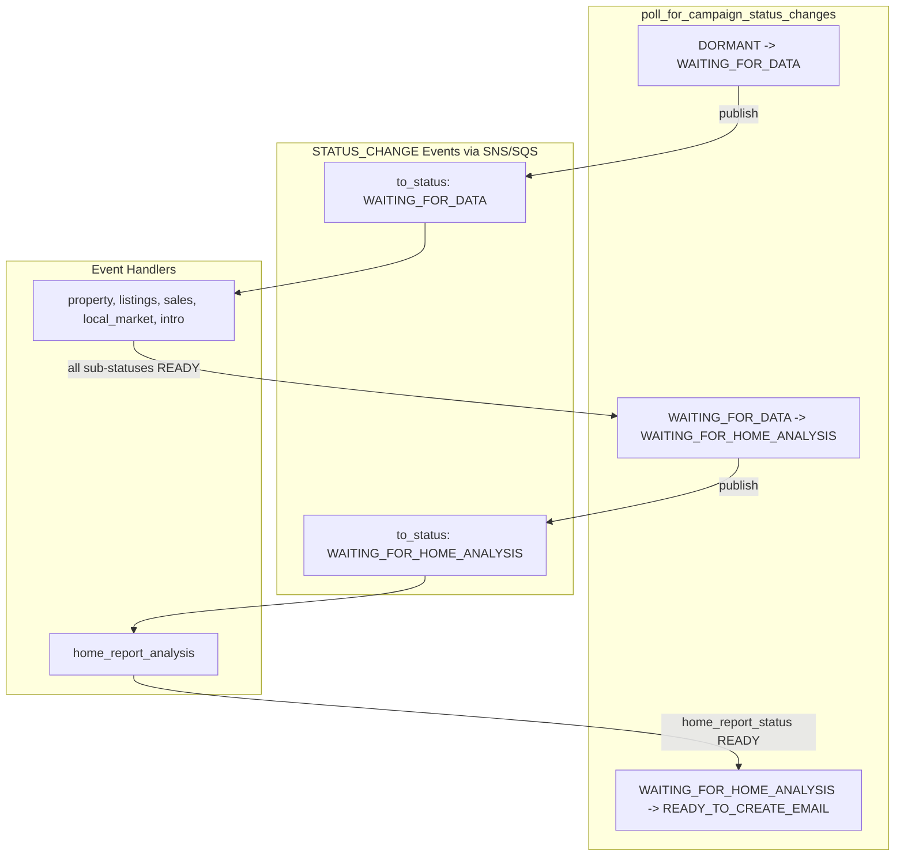

# Intro & Home Report Analysis Event-Driven Migration

## Architecture Overview




## Campaign Status Flow

```javascript
DORMANT → WAITING_FOR_DATA → WAITING_FOR_HOME_ANALYSIS → READY_TO_CREATE_EMAIL → READY_TO_SEND_EMAIL
```

**Transition conditions (managed by poll_for_campaign_status_changes):**| From | To | Condition ||------|-----|-----------|| DORMANT | WAITING_FOR_DATA | `next_send_datetime` has arrived || WAITING_FOR_DATA | WAITING_FOR_HOME_ANALYSIS | ALL sub-statuses = READY (property, listings, sales, local_market, intro) || WAITING_FOR_HOME_ANALYSIS | READY_TO_CREATE_EMAIL | `home_report_analysis_status` = READY |

## Sub-Status Fields

| Field | Purpose | Triggered By ||-------|---------|--------------|| `property_status` | Property valuation | WAITING_FOR_DATA event || `active_listing_status` | Active listings | WAITING_FOR_DATA event || `recent_sale_status` | Recent sales | WAITING_FOR_DATA event || `local_market_data_status` | Local market data | WAITING_FOR_DATA event || `intro_status` | Intro generation (NEW) | WAITING_FOR_DATA event || `home_report_analysis_status` | Home report analysis (NEW) | WAITING_FOR_HOME_ANALYSIS event |**Note:** `intro_and_home_report_analysis_status` will be renamed to `intro_status`, and a new `home_report_analysis_status` column will be added.

## Data Dependencies

| Handler | Requires | Notes ||---------|----------|-------|| `handle_intro_event` | `local_market_data`, `mortgage_rate` | No property data needed || `handle_home_report_event` | `property_data` (formatted_address, current_value, etc.) | Property must be READY before this runs (guaranteed by state machine) |**No-address campaigns:** Pass through WAITING_FOR_HOME_ANALYSIS, but handler immediately sets `home_report_analysis_status` = READY without LLM call.

## Status Enum Separation

Split the monolithic `Status` enum into purpose-specific enums:**Current `Status` enum (to be removed):**

```python
DORMANT, WAITING_FOR_DATA, FETCHING, READY_TO_CREATE_EMAIL, 
WAITING_FOR_MANUAL_APPROVAL, READY_TO_SEND_EMAIL, SENT, UNSUBSCRIBED, ERROR
```

**New `CampaignStatus` enum:**

```python
DORMANT                    # Waiting for next send date
WAITING_FOR_DATA           # Data fetching in progress
WAITING_FOR_HOME_ANALYSIS  # NEW - All data ready, generating home report
READY_TO_CREATE_EMAIL      # Ready to create email
WAITING_FOR_MANUAL_APPROVAL
READY_TO_SEND_EMAIL
UNSUBSCRIBED
ERROR
```

**New `SubStatus` enum (for data fetching sub-statuses):**

```python
DORMANT
WAITING_FOR_DATA
READY                      # Simplified from READY_TO_CREATE_EMAIL
ERROR
```

**Notes:**

- `FETCHING` is removed - SQS visibility timeout handles locking for event-driven operations
- `SENT` is removed from campaign statuses - only relevant for emails (`DeliveryStatus.SENT`)
- `Email.status` field may be deprecated in favor of `Email.delivery_status` (future cleanup)
- For remaining polling operations (email creation, email sending), `skip_locked=True` provides sufficient database-level locking

## Implementation Steps

### Step 1: Database Migration

Update [`python/shared_resources/models.py`](python/shared_resources/models.py):

- Create `CampaignStatus` enum with WAITING_FOR_HOME_ANALYSIS
- Create `SubStatus` enum (DORMANT, WAITING_FOR_DATA, READY, ERROR)
- Remove old `Status` enum
- Update Campaign model to use new enums

Create Alembic migration to:

- Rename column `intro_and_home_report_analysis_status` → `intro_status`
- Add new column `home_report_analysis_status` (default: DORMANT)
- Update enum values in database (READY_TO_CREATE_EMAIL → READY for sub-statuses)

### Step 2: Add Queue URLs to Environment

Update [`local-dev.env`](local-dev.env) and [`prod.env`](prod.env):

```javascript


SQS_INTRO_QUEUE_URL='...'
SQS_HOME_REPORT_QUEUE_URL='...'
```


### Step 3: Split Bedrock Functions

Update [`python/shared_resources/bedrock_campaign_client.py`](python/shared_resources/bedrock_campaign_client.py):

- Create `generate_intro(local_market_data, mortgage_rate, campaign_id)` → returns plain text (no JSON)
- Create `generate_home_report_analysis(property_data)` → returns plain text (no JSON)
- Update prompts to request unformatted text output instead of JSON
- Deprecate/remove `generate_intro_and_analysis()`

**Prompt changes:**

- Remove JSON schema instructions from `context.txt` and `context-no-address.txt`
- Update prompts to simply return the text content directly

### Step 4: Update DB Client

Update [`python/shared_resources/db_client.py`](python/shared_resources/db_client.py):

- Replace all `Status.X` references with `CampaignStatus.X` or `SubStatus.X` as appropriate
- Rename all references from `intro_and_home_report_analysis_status` → `intro_status`
- Add `edit_intro_status_on_campaign()`
- Add `edit_home_report_analysis_status_on_campaign()`
- Update `edit_campaigns_status_that_are_ready_for_data_updates()` to initialize both new fields
- Add new transition: WAITING_FOR_DATA → WAITING_FOR_HOME_ANALYSIS (when all sub-statuses READY)
- Add new transition: WAITING_FOR_HOME_ANALYSIS → READY_TO_CREATE_EMAIL (when home_report READY)
- Ensure STATUS_CHANGE events are published for both transitions
- Remove FETCHING-based locking from polling functions that are now event-driven

### Step 5: Create Event Handlers

Update [`python/data_fetcher/event_handlers.py`](python/data_fetcher/event_handlers.py):**`handle_intro_event(payload, bedrock_client)`:**

- Filter: `to_status == WAITING_FOR_DATA`
- Fetch `local_market_data` and `mortgage_rate`
- Generate intro via `generate_intro()`
- Save intro to campaign, set `intro_status` → READY_TO_CREATE_EMAIL

**`handle_home_report_event(payload, bedrock_client)`:**

- Filter: `to_status == WAITING_FOR_HOME_ANALYSIS`
- If `no_address_newsletter=1`: Set `home_report_analysis_status` → READY (no LLM)
- Else: Fetch `property_data`, generate via `generate_home_report_analysis()`, save, set status → READY

### Step 6: Update data_fetcher.py

Update [`python/data_fetcher/data_fetcher.py`](python/data_fetcher/data_fetcher.py):

- Add `SQS_INTRO_QUEUE_URL` and `SQS_HOME_REPORT_QUEUE_URL` env vars
- Add `poll_intro_events()` consumer thread
- Add `poll_home_report_events()` consumer thread
- Remove old `poll_for_home_report_analysis_and_intro()` function

### Step 7: Update Documentation

Update [`docs/campaign-state-machine.md`](docs/campaign-state-machine.md) and [`docs/system-design.md`](docs/system-design.md) to reflect new status flow and event architecture.---

## REMINDER: Next Scope of Work

**Before deploying the FETCHING removal**, migrate `email_manager` to event-based architecture:

1. **Email Creation**: Replace `get_campaign_ready_to_create_email()` polling with event queue

- Trigger: `campaign_status` → `READY_TO_CREATE_EMAIL`
- Queue: `dripr-email-creation-queue-*`