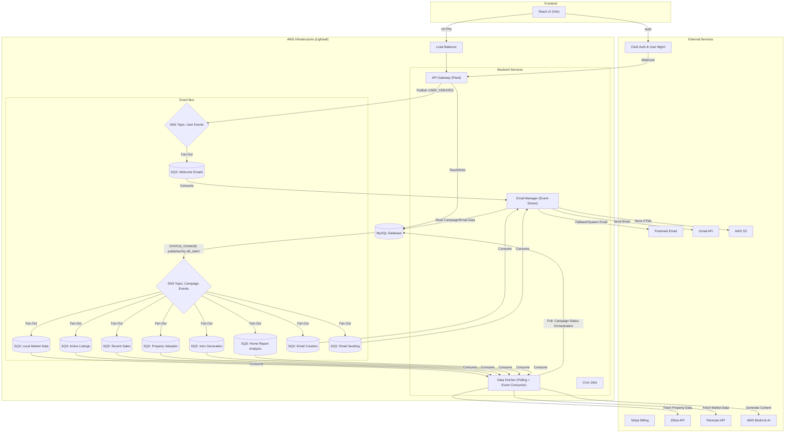

# Dripr System Design & Architecture

## 1. System Overview

Dripr is a vertical SaaS application for real estate agents to automate personalized email drip campaigns. It operates on a **Distributed Polling Architecture** augmented by an **Event-Driven Subsystem** for improved scalability and decoupling of critical user flows.

The system is deployed as a set of containerized microservices on **AWS Lightsail Container Services**, orchestrating data fetching, content generation (AI), and email delivery.

## 2. High-Level Architecture

The system follows a hybrid architecture:
1.  **Polling-Based State Machine:** Campaign status orchestration is driven by database state polling in data_fetcher.
2.  **Event-Driven Processing:** All data fetching (local market data, active listings, recent sales, property valuation, intro generation, home report analysis), email creation, email sending, and user lifecycle events use AWS SNS + SQS for scalability and decoupling.

### Architecture Diagram

## 3. Core Services

### 3.1 API Gateway (`python/api_gateway`)
*   **Role:** The entry point for the Frontend and External Webhooks.
*   **Tech Stack:** Flask, Gunicorn.
*   **Key Responsibilities:**
    *   **User Management:** Handles Clerk webhooks (User Created/Updated).
    *   **Campaign Management:** CRUD operations for campaigns.
    *   **Billing:** Stripe webhook handling and subscription enforcement.
    *   **Event Publisher:** Publishes authoritative events (e.g., `USER_CREATED`) to SNS.

### 3.2 Data Fetcher (`python/data_fetcher`)
*   **Role:** The heavy-lifting background worker that populates campaign data and orchestrates campaign status transitions.
*   **Architecture:** Hybrid (Polling Threads + Event Consumers).
*   **Key Responsibilities:**
    *   **Event Consumers (SQS):**
        *   `poll_local_market_data_events()` - Processes local market data updates
        *   `poll_active_listings_events()` - Fetches active listings for campaigns
        *   `poll_recent_sales_events()` - Fetches recent sales for campaigns
        *   `poll_property_valuation_events()` - Fetches property data from Zillow/Google Maps
        *   `poll_intro_events()` - Generates personalized intro text via AWS Bedrock
        *   `poll_home_report_events()` - Generates home report analysis via AWS Bedrock
    *   **Polling Threads (Database):**
        *   Campaign status orchestration (transitions between campaign states):
            *   `DORMANT` → `WAITING_FOR_DATA` (when next send date arrives, calculated using fixed monthly send day)
            *   `WAITING_FOR_DATA` → `WAITING_FOR_HOME_ANALYSIS` (when all data is ready)
            *   `WAITING_FOR_HOME_ANALYSIS` → `READY_TO_CREATE_EMAIL` (when home report is ready)
            *   `READY_TO_CREATE_EMAIL` → `READY_TO_SEND_EMAIL` (when email is created, approved, and first-time delay has passed)
    *   **Next Send Date Calculation:** Campaigns use `fixed_send_day` (1-28) to determine when subsequent emails send. First email scheduling considers `FIRST_TIME_CAMPAIGN_DELAY_HOURS` and the relationship between campaign creation date and `fixed_send_day` (see Campaign State Machine documentation).
    *   Orchestrates data fetching from **Zillow** (RapidAPI) and **Rentcast**.
    *   Calculates local market stats (interest rate changes, price trends).
    *   Calls **AWS Bedrock** (Claude) to generate personalized intros and home analyses.

### 3.3 Email Manager (`python/email_manager`)
*   **Role:** Handles email generation and delivery.
*   **Architecture:** Fully Event-Driven (Three Event Consumers).
*   **Key Responsibilities:**
    *   **Email Creation Consumer:** Listens for `STATUS_CHANGE` events (to `READY_TO_CREATE_EMAIL`) to trigger email creation. Before creating a new email, expires any old unapproved emails from the campaign. Creates the email record with `scheduled_send_datetime` (calculated via `calculate_next_send_datetime()`, which considers `fixed_send_day`, `FIRST_TIME_CAMPAIGN_DELAY_HOURS`, and whether it's the first or subsequent email) and updates `Campaign.last_scheduled_send_date`. Sets `Campaign.email_creation_status = READY`.
    *   **Email Sending Consumer:** Listens for `STATUS_CHANGE` events (to `READY_TO_SEND_EMAIL`) to trigger email delivery. Respects working hours (11am-6pm EST) by calculating sleep duration until next sending window when enabled. By the time this consumer receives an event, the data_fetcher poller has already verified approval status and first-time campaign delay requirements. Marks emails as `status=COMPLETE` upon sending.
    *   **Welcome Email Consumer:** Listens for `USER_CREATED` events to trigger "Welcome Emails".
    *   **Rendering:** Compiles Handlebars templates (`.hbs`) with dynamic data.
    *   **Delivery:** Sends via Gmail API (User's OAuth) or Postmark (System/Fallback).

### 3.4 Shared Resources (`python/shared_resources`)
*   **Role:** A shared library containing core business logic, database models, and clients.
*   **Key Components:**
    *   `db_client.py`: Singleton database access pattern with connection pooling.
    *   `event_bus.py`: Abstraction for AWS SNS/SQS interactions.
    *   `models.py`: SQLAlchemy ORM definitions.
    *   `zillow_client_manager.py`: Centralized Zillow client selection/fallback and runtime factory.

#### Zillow Client Selection (Single Change Point)
- Runtime services should create Zillow clients via `create_zillow_client()` from `zillow_client_manager.py`.
- The selected implementation is controlled in one place via `DEFAULT_PRIMARY_SOURCE` (`V1` or `V2`).
- `zillow_client_v1.py` and `zillow_client_v2.py` remain interchangeable implementations behind `ZillowClientProtocol`.

## 4. Event-Driven Subsystem

To improve scalability and reliability, Dripr uses an **SNS + SQS Fan-Out Pattern** for multiple workflows.

### 4.1 User Events (Welcome Emails)
1.  **Trigger:** User signs up via UI or is provisioned via Admin Script (Clerk).
2.  **Producer:** `api_gateway` receives Clerk Webhook, creates `User` in DB, and publishes `USER_CREATED` to **SNS Topic** (`dripr-user-events-topic`).
3.  **Fan-Out:** SNS pushes the message to `dripr-welcome-emails-queue`.
4.  **Consumer:** `email_manager` polls the SQS queue.
5.  **Logic (Silent Onboarding):**
    *   If `managed_client_id` is present in metadata: **SKIP** welcome email (Silent).
    *   If `managed_client_id` is missing: **SEND** welcome email (Self-Serve).

### 4.2 Campaign Events (Data Fetching & Email Processing)
1.  **Trigger:** Campaign status transitions to `WAITING_FOR_DATA`, `WAITING_FOR_HOME_ANALYSIS`, `READY_TO_CREATE_EMAIL`, or `READY_TO_SEND_EMAIL`.
2.  **Producer:** `db_client.publish_campaign_status_change()` publishes `STATUS_CHANGE` to **SNS Topic** (`dripr-campaign-events-topic`).
3.  **Fan-Out:** SNS pushes the message to multiple SQS queues:
    *   `dripr-local-market-updates-queue` - Local market data processing
    *   `dripr-active-listings-queue` - Active listings fetching
    *   `dripr-recent-sales-queue` - Recent sales fetching
    *   `dripr-property-valuation-queue` - Property data fetching (Zillow/Google Maps)
    *   `dripr-intro-queue` - Intro text generation (AWS Bedrock)
    *   `dripr-home-report-queue` - Home report analysis generation (AWS Bedrock)
    *   `dripr-email-creation-queue` - Email creation processing
    *   `dripr-email-sending-queue` - Email delivery processing
4.  **Consumers:** 
    *   `data_fetcher` event handlers process data fetching queues independently
    *   `email_manager` event handlers process email creation and sending queues
5.  **Validation:** 
    *   Data fetching handlers check `to_status == CampaignStatus.WAITING_FOR_DATA.value` before processing
    *   Home report handler checks `to_status == CampaignStatus.WAITING_FOR_HOME_ANALYSIS.value` before processing
    *   Email creation handler checks `to_status == CampaignStatus.READY_TO_CREATE_EMAIL.value` before processing
    *   Email sending handler checks `to_status == CampaignStatus.READY_TO_SEND_EMAIL.value` before processing
6.  **Optimization:** Active listings and recent sales use zip code coordinates only (no property_data dependency).
7.  **Sequential Processing:** Intro generation happens in parallel with data fetching. Home report analysis waits until property data is ready. Email creation waits until all data is ready.
8.  **Email Sending Gate:** After email creation, campaigns remain in `READY_TO_CREATE_EMAIL` with `email_creation_status=READY`. A poller in `data_fetcher` (`edit_campaigns_status_that_are_ready_for_email_sending()`) checks for:
    *   Email approval (either auto-approved with `check_before_sending=0` OR manually approved with `Email.approved=1`)
    *   First-time campaign delay (campaigns with `last_sent_email_datetime=NULL` must wait `FIRST_TIME_CAMPAIGN_DELAY_HOURS` from creation)
    *   Campaign is enabled
    
    When all conditions are met, the poller transitions the campaign to `READY_TO_SEND_EMAIL` and publishes a `STATUS_CHANGE` event, triggering the email sending consumer. This prevents flooding the SQS queue with messages that aren't ready to be processed.

## 5. External Integrations

| Service | Purpose | Key Details |
| :--- | :--- | :--- |
| **Clerk** | Auth & User Mgmt | Handles all login/registration. Stores `managed_client_id` in metadata. |
| **Postmark** | System Emails | Used for Welcome Emails, Magic Links, and delivering campaigns (fallback). |
| **Gmail API** | User Emails | Allows agents to send campaigns from their own G-Suite accounts. |
| **AWS Bedrock** | AI Content | Generates "Intro" and "Home Analysis" text using Claude. |
| **Stripe** | Billing | Manages subscriptions. Webhooks control `User.subscription_status`. |
| **Zillow/Rentcast** | Data Sources | Zillow implementation is selected centrally via `zillow_client_manager.py`; Rentcast uses `rentcast_client.py`. |

## 6. Deployment & Infrastructure

*   **Platform:** AWS Lightsail Container Services.
*   **Containerization:** Docker (Standard `Dockerfile` for Python services).
*   **Registry:** AWS ECR (`public.ecr.aws`).
*   **CI/CD:** Shell scripts (`build-and-push-to-aws.sh`) handle multi-service builds and deployment.
*   **Environments:**
    *   `prod`: Production database, live Stripe/Clerk keys.
    *   `dev` (Local): Connects to staging DB or Mock services.

### Admin Tools
*   **Managed User Provisioning:** CLI script (`python/scripts/create_managed_user.py`) bypasses standard onboarding for B2B partners.
